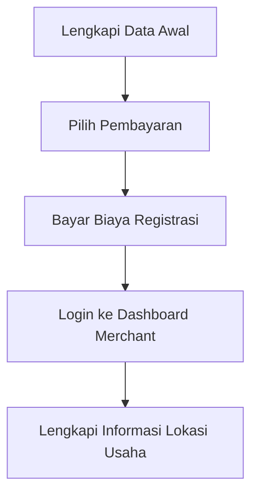

## Registrasi QRIS
Web Pendaftaran Merchant (QRIS) dengan desain tampilan baru.


## Tech
Aplikasi ini dibuat menggunakan PHP Native
## Requirement
- Server (VPS, VM atau Hosting)
- Database
- PHP minimal 8.0
## Installation
```sh
# Jika menggunakan xampp / laragon 
$ git clone
$ jika menggunakan xampp letakkan aplikasi di folder htdocs atau jika menggunakan laragon taruh di folder www
$ konfigurasi database
$ akses di browser dengan alamat http://localhost/{nama_folder}
# Jika menggunakan VPS
$ git clone
$ konfigurasi database
$ konfigurasi app server nginx / wampp / apache 
$ akses di browser dengan alamat yang di setting pada konfigurasi app server
```
## Flow Dashboard QRIS


## Daftar Function Pada Registrasi QRIS
```php redirect halaman
  function redirpg($gopage,$msgtxt = ""){
		?>
		<script type="text/javascript">
			<?php if(!empty($msgtxt)){?>alert("<?php echo $msgtxt; ?>");<?php } ?>
			<?php echo "window.location='$gopage'"; ?>
		</script>
		<?php
	}
```

```php generate tiket untuk nomor registrasi
  function generateTicket($force = ""){
		global $conn_model;
		if(!isset($_SESSION['valid_user']) || $force == 1 || $force == 2 || strpos($_SESSION['valid_user'], "reg_") === false){
			$valid_user = "";
			$tiket = uniqid('ticket_', true);
			$insert_query = "INSERT INTO qris_merchant_temp (reg_temporary) VALUES ('$tiket')";	
			if(mysqli_query($conn_model, $insert_query)) {
				$result = mysqli_query($conn_model, "CALL GenerateRegsession('$tiket',@v_baseCode)");
				while(mysqli_next_result($conn_model)) { }
				if($result) {
					$rowSP = mysqli_fetch_assoc($result);
					$valid_user = 'reg_'.$rowSP['v_baseCode'];
					if(isset($_SESSION['valid_user']) && $force == 1){ // jika ada sesi sebelumnya dan force = 1, create log
						loginfo("info",$_SESSION['valid_user']." user membuat baru registrasi. sistem mereset reg ID menjadi ".$valid_user);
					}
					$_SESSION['valid_user'] = $valid_user;
					// $_SESSION['regV2'] = 1; // untuk switching ke v1 atau versi generate regsession yang lain
					return $valid_user;
				} else {
					loginfo("error","Gagal memanggil store procedure GenerateRegsession() tiket ".$tiket);
					redirpg($pagecur0 . "pages/registration.php&pgv=new-merchant&step=1","Mohon maaf atas ketidaknyamanannya, sistem mengalami kendala. harap laporkan kepada kami. terima kasih");	
					return false;
				}
			}else{
				loginfo("error","Gagal insert tiket ".$tiket);
				redirpg($pagecur0 . "pages/registration.php&pgv=new-merchant&step=1","Mohon maaf atas ketidaknyamanannya, sistem mengalami kendala. harap laporkan kepada kami. terima kasih");	
				return false;
			}
			mysqli_close($conn_model);
		}
	}
```


